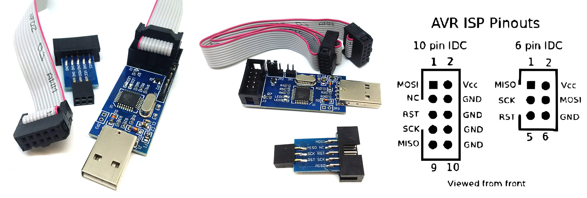
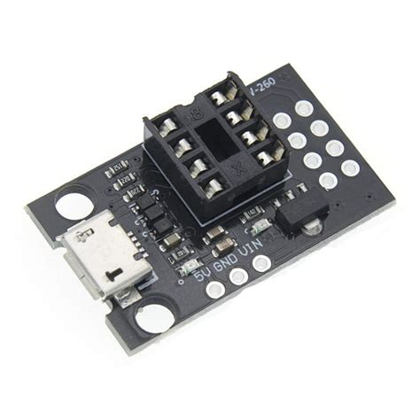

# Large LED Heart PCB Pendant
> A large heart with 20 individually controllable LEDS using 4 pins on an ATtiny 45 with Charlieplexing
> This is an easy to solder project, as all components are trough hole, except for the large and easy to solder battery holder
> Who would not like to be pledged eternal love to by their valentine giving them a large blinky LED heart Pendant!

## Table of Contents
* [General Info](#general-information)
* [Technologies Used](#technologies-used)
* [Features](#features)
* [Images](#images)
* [Setup](#setup)
* [Usage](#usage)
* [Project Status](#project-status)
* [Room for Improvement](#room-for-improvement)
* [Acknowledgements](#acknowledgements)
* [Contact](#contact)
<!-- * [License](#license) -->

## General Information
- I developed this project, in order to introduce my daughters to electronics. This pendant can be used to introduce STEAM concepts at many levels. It can be used to introduce electronics, teach trough hole assembly/soldering and programming.
- This is a basic demonstration of the Charlieplexing principle. The heart can be used stand alone or in a pendant.
- I used FreeCAD in order to design the heart shape. Unfortunately at the time of designing, the offset tool was not available in FreeCAD (I know there are work arounds), and I completed the snap on case design using Fusion360.
- I skipped the breadboard prototyping phase by using the proven Circuit design from designer2k2. The first version of the PCB worked as per design.
- For printing the case, I used PLA, 40% infill and 0.2mm layer height. It easily snaps onto the PCB, and while the stand offs include m3 thread, the M3 x6mm bolts are not required as the 45 degrees edge on the case holds it in place. I would not reccomend using without case as the back of a trough hole PCB can be demanding blood like a Vampire from Transylvania.
<!-- You don't have to answer all the questions - just the ones relevant to your project. -->

## Technologies Used
- Ubuntu 20.10 OS
- FreeCAD Realthunder branch (2021.10.15) for designing the heart shape
- KiCad 5.99.0+really5.1.10+dfsg1-1, release build
- Freerouting 1.4.5 (Current KiCad does not have an autorouter)
- Fusion 360 for designing the heart case
- Prusa slicer (1.4.0)
- Arduino IDE 1.8.19 for flashing firmware and uploading the code.
- Attiny core library (https://github.com/SpenceKonde/ATTinyCore)

## Features
This project has the following awesome features:
- uses 5 pins, in order to individually control 20 LEDs
- The project uses trough hole components (with exception of easy to solder battery holder for easy assembly)
- The 3D printed snap on case projects (young) fingers from the sharp spikes on the back of the trough hole PCB.
- I used the HW-260 and USBASP in order to program the ATtiny45. However, the ATtiny45 can also be programmed using the connector on the PCB.

## images

<!-- If you have screenshots you'd like to share, include them here. -->

## Setup
0) order PCB and parts (I used JLPCB, Aliexpress and Digikey)
1) Program the ATtiny45 chip using the HW-260 & USBASP programmer. You will need to flash the bootloader @1 MHZ and upload the .ino code. (https://www.instructables.com/ATtiny13AATtiny25ATtiny45ATtiny85-Programming-With/) Hint: use <CTRL>+<SHIFT>+<U> in order to upload using programmer.
2) Start printing the snap on case.
3) Heat up that iron and put the PCB together.
4) Snap on the snap on case.
5) Introduce STEAM or propose to your dearest.

## Usage
Simply switch the heart on/off as required.

## Project Status
Project is complete.

## Room for Improvement
The heart is rather large for a pendant. I may develop a smaller version based on surface mount components in the future.

Room for improvement:
- With the ATtiny 45 there is more memory space. It could be programmed to cycle trough more/longer patterns.
- An eye could be added to the 3d printed snap fit case, for pendant usage. Currently only the 3mm hole is available, which may be a bit small for strings.
- One of the M3 holes is covered by the switch. However, the case is snap fit and does not need the M3 hardware to stay in place.

## Acknowledgements
- Circuit and code was based on ATtiny Powered Christmas Tree
https://github.com/designer2k2/2d-xmas-tree
https://github.com/designer2k2/2d-xmas-tree
- USBASP pinout image from: kabelverdrahtungsschema.blogspot.com

- Many thanks to my daughters for relentless beta testing

## Contact
Created by [SaltyPaws](https://github.com/SaltyPaws) - feel free to contact me!

## License
This project is open source and available under the MIT License.
